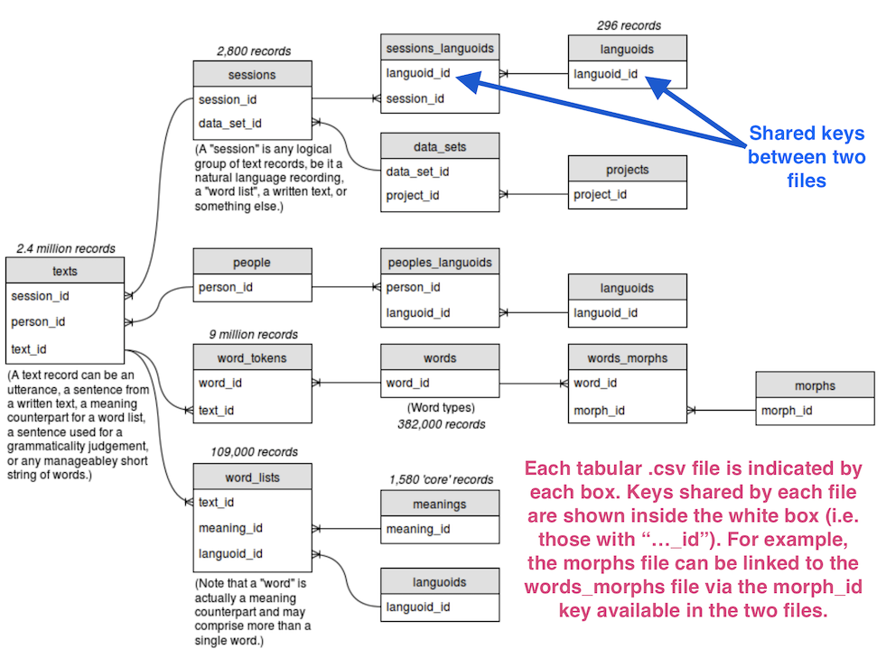

<style type="text/css">
  body{
  font-size: 16pt;
}
</style>

```{r setup, message = FALSE, echo = FALSE, include = FALSE}
# global option chunck
knitr::opts_chunk$set(fig.width = 7, 
                      fig.asp = 0.618,
                      fig.retina = 2,
                      dpi = 300,
                      dev = "png",
                      echo = FALSE,
                      message = FALSE,
                      warning = FALSE,
                      fig.path = "figures/")

# load packages
suppressPackageStartupMessages(library(tidyverse))
suppressPackageStartupMessages(library(maps))
suppressPackageStartupMessages(library(mapdata))
suppressPackageStartupMessages(library(ggthemes))
suppressPackageStartupMessages(library(ggrepel))

# load the main non-acquisition meta-data for all the Malayic varieties
non_acquisition_malayic_sessions_dataset_project <- readr::read_tsv("data/non_acquisition_malayic_sessions_dataset_project.tsv")
non_acquisition_malayic_sessions_dataset_project_mini <- non_acquisition_malayic_sessions_dataset_project %>% 
  select(session_id, session_name, data_set_name, project_name, word_count, 
         languoid_name_new, elicited_or_natural, genre, subgenre, mode, classification) %>% 
  distinct() %>% 
  mutate(genre = str_to_lower(genre),
         subgenre = replace(subgenre, subgenre == "\"Other\"", "Other"),
         subgenre = replace(subgenre, subgenre == "Traditonalfolk story", 
                            "traditional folk story"),
         subgenre = str_replace(subgenre, "^(?i)traditonal", "traditional"),
         subgenre = str_to_lower(subgenre),
         mode = replace(mode, mode == "Spoke", "spoken"),
         mode = str_to_lower(mode),
         elicited_or_natural = str_replace(elicited_or_natural, "^(?i)(na)r(tural)", "\\1\\2"),
         elicited_or_natural = str_to_lower(elicited_or_natural))

# generate word counts
non_acquisition_malayic_word_count <- sum(non_acquisition_malayic_sessions_dataset_project$word_count)
word_count_per_project_name <- dplyr::summarise(dplyr::group_by(non_acquisition_malayic_sessions_dataset_project, project_name), word_count_project = sum(word_count))
word_count_per_data_set_name <- dplyr::summarise(dplyr::group_by(non_acquisition_malayic_sessions_dataset_project, data_set_name), word_count_data_set = sum(word_count))
word_count_per_languoid_name <- dplyr::summarise(dplyr::group_by(non_acquisition_malayic_sessions_dataset_project, languoid_name_new), word_count_languoid = sum(word_count))
word_count_per_classification <- dplyr::summarise(dplyr::group_by(non_acquisition_malayic_sessions_dataset_project, classification), word_count_classification = sum(word_count))
word_count_per_region <- dplyr::summarise(dplyr::group_by(non_acquisition_malayic_sessions_dataset_project, region), word_count_region = sum(word_count))

# load the main happy lexicon database
malayic_happy <- readr::read_tsv("data/malayic_happy.tsv") %>% 
  filter(str_detect(gloss_text, "joy grief", negate = TRUE)) %>% 
  mutate(morphs = replace(morphs, morphs == "Happy", "happy"),
         word_form = replace(word_form, word_form == "Happy", "happy"))

# load the data with the latitude and longitude variables
malayic_happy_freq_long_lat <- readr::read_tsv("data/malayic_happy_freq_long_lat.tsv") %>% 
  select(project_name, region, province, data_set_name, languoid_name_new, 
         latitude, longitude, morphs, gloss) %>% 
  distinct() %>% 
  mutate(morphs = replace(morphs, morphs == "Happy", "happy"))

# get the indonesian province latitude and longitude data
indoprov <- readr::read_tsv("data/indo-prov-latlong.csv")
```

```{r eval = FALSE}
# generate bibliographies for R packages
knitr::write_bib(c(
  .packages(), "bookdown", "knitr", "rmarkdown", "tidyverse", 
  "maps", "mapdata", "ggthemes", "ggrepel"
), "packages.bib")
```


```{r number-2-words-function}
## Function by John Fox found here:
## http://tolstoy.newcastle.edu.au/R/help/05/04/2715.html
## Tweaks by AJH to add commas and "and"
## https://gist.github.com/psychemedia/150cb9901529da58124a
numbers2words <- function(x) {
    helper <- function(x){

    digits <- rev(strsplit(as.character(x), "")[[1]])
    nDigits <- length(digits)
    if (nDigits == 1) as.vector(ones[digits])
    else if (nDigits == 2)
      if (x <= 19) as.vector(teens[digits[1]])
    else trim(paste(tens[digits[2]],
                    Recall(as.numeric(digits[1]))))
    else if (nDigits == 3) trim(paste(ones[digits[3]], "hundred and",
                                      Recall(makeNumber(digits[2:1]))))
    else {
      nSuffix <- ((nDigits + 2) %/% 3) - 1
      if (nSuffix > length(suffixes)) stop(paste(x, "is too large!"))
      trim(paste(Recall(makeNumber(digits[
        nDigits:(3*nSuffix + 1)])),
        suffixes[nSuffix],"," ,
        Recall(makeNumber(digits[(3*nSuffix):1]))))
    }
  }
  trim <- function(text){
    #Tidy leading/trailing whitespace, space before comma
    text=gsub("^\ ", "", gsub("\ *$", "", gsub("\ ,",",",text)))
    #Clear any trailing " and"
    text=gsub(" and$","",text)
    #Clear any trailing comma
    gsub("\ *,$","",text)
  }
  makeNumber <- function(...) as.numeric(paste(..., collapse=""))
  #Disable scientific notation
  opts <- options(scipen=100)
  on.exit(options(opts))
  ones <- c("", "one", "two", "three", "four", "five", "six", "seven",
            "eight", "nine")
  names(ones) <- 0:9
  teens <- c("ten", "eleven", "twelve", "thirteen", "fourteen", "fifteen",
             "sixteen", " seventeen", "eighteen", "nineteen")
  names(teens) <- 0:9
  tens <- c("twenty", "thirty", "forty", "fifty", "sixty", "seventy", "eighty",
            "ninety")
  names(tens) <- 2:9
  x <- round(x)
  suffixes <- c("thousand", "million", "billion", "trillion")
  if (length(x) > 1) return(trim(sapply(x, helper)))
  helper(x)
}
```

```{r cross-tabulation}
# count the distribution for the morphs with `gloss`, `data_set_name`, `region`, `project_name`, and `languoid_name_new`.
malayic_happy_freq <- malayic_happy %>% 
  count(morphs, gloss, data_set_name, region, project_name, languoid_name_new) %>% 
  select(project_name, region, data_set_name, languoid_name_new, morphs, gloss, n) %>% 
  arrange(project_name, region, data_set_name, languoid_name_new, desc(n), morphs, gloss) %>% 
  mutate(gloss = str_replace(gloss, "[:.][A-Z]$", ""))
```

```{r count-freq-morphs}
# count the distribution of the morphs only
malayic_happy_freq_morphs <- malayic_happy_freq %>% 
  group_by(morphs) %>% 
  summarise(n = sum(n)) %>% 
  arrange(morphs, desc(n)) %>% 
  # add the Indonesian lemma information of the morphs
  mutate(lemma = "BAHAGIA",
         lemma = if_else(morphs %in% c("arawʔ", "aroʔ", "karóq"), "(K)AROʔ", lemma),
         lemma = if_else(morphs %in% c("ceria"), "CERIA", lemma),
         lemma = if_else(morphs %in% c("gambira", "gembira", "gembiré", "gɛmbira"), "GEMBIRA", lemma),
         lemma = if_else(morphs %in% c("girang"), "GIRANG", lemma),
         lemma = if_else(morphs %in% c("happy", "Happy", "hepe", "hépi", "hɛpi", "hepi"), "HAPPY", lemma),
         lemma = if_else(morphs %in% c("ladas"), "LADAS", lemma),
         lemma = if_else(morphs %in% c("naŋ"), "SENANG", lemma),
         lemma = if_else(morphs %in% c("ria"), "RIA", lemma),
         lemma = if_else(morphs %in% c("ribang"), "RIBANG", lemma),
         lemma = if_else(morphs %in% c("semore"), "SEMORE", lemma),
         lemma = if_else(morphs %in% c("sanang", "senang", "sénang", "seneng", "sənang", "sənaŋ", "snang", "snaŋ", "sonaŋː", "sonaŋ", "sna"), "SENANG", lemma),
         lemma = if_else(morphs %in% c("sukacita"), "SUKACITA", lemma),
         lemma = if_else(morphs %in% c("suké", "suka"), "SUKA", lemma),
         lemma = if_else(morphs == "ladɐys", "LADAS", lemma),
         lemma = if_else(morphs == "jɔy", "JOY", lemma),
         lemma = if_else(morphs %in% c("krtən", "kɨrtən"), toupper("kɨrtən"), lemma),
         lemma = if_else(morphs == "boroi", "BOROI", lemma),
         lemma = if_else(morphs == "iyaŋ", "IYANG", lemma))
```


```{r count-freq-lemma}
# count the distribution of the lemmas only
malayic_happy_freq_lemma <- malayic_happy_freq_morphs %>% 
  group_by(lemma) %>% 
  summarise(n = sum(n), .groups = "drop") %>% 
  arrange(desc(n)) %>% 
  mutate(perc_lemma = round(n / sum(n) * 100, 2))

# mark the singleton lemma as 'OTHERS'
malayic_happy_freq_lemma <- malayic_happy_freq_lemma %>% 
  mutate(lemma_new = if_else(perc_lemma < 1, "OTHERS", lemma))
```

```{r combine-lemma-to-malayic-main-happy-freq}
# combine the lemma into the `malayic_happy_freq`
malayic_happy_freq <- malayic_happy_freq %>% 
  left_join(malayic_happy_freq_morphs %>%
              select(-n), 
            by = "morphs") %>% 
  left_join(malayic_happy_freq_lemma %>% 
              select(-n),
            by = "lemma")
```


```{r combine-geographical-location-data}
malayic_happy_freq <- malayic_happy_freq %>% 
  left_join(malayic_happy_freq_long_lat,
            by = c("project_name", "region", "data_set_name", 
                   "languoid_name_new", "morphs", "gloss")) %>% 
  left_join(indoprov, by = "province")
```

```{r summarise-token-of-lemma-by-project-name-and-region}
# summarise token-frequency of the lemma by project_name and region
malayic_happy_lemma_freq_by_project_region <- malayic_happy_freq %>% 
  group_by(project_name, region, lemma) %>% 
  summarise(n = sum(n), .groups = "drop") %>% 
  arrange(project_name, region, desc(n), lemma)
```

```{r summarise-token-of-lemma-by-languoid-name-and-region, eval = FALSE}
# summarise token-frequency of the lemma by languoid_name_new and region
malayic_happy_lemma_freq_by_languoid_region <- malayic_happy_freq %>% 
  group_by(languoid_name_new, region, lemma) %>% 
  summarise(n = sum(n), .groups = "drop") %>% 
  arrange(languoid_name_new, region, desc(n), lemma)
```

```{r summarise-token-of-lemma-by-languoid-name, eval = FALSE}
# summarise token-frequency of the lemma by languoid_name_new
malayic_happy_lemma_freq_by_languoid <- malayic_happy_freq %>% 
  group_by(languoid_name_new, lemma) %>% 
  summarise(n = sum(n), .groups = "drop") %>% 
  arrange(languoid_name_new, desc(n), lemma)
```

```{r summarise-token-of-lemma-and-percentages-by-region}
# summarise token-frequency and percentages of the lemma by region
malayic_happy_lemma_freq_perc_by_region <- malayic_happy_freq %>% 
  group_by(region, lemma) %>% 
  summarise(n = sum(n), .groups = "drop") %>% 
  arrange(region, desc(n), lemma) %>% 
  group_by(region) %>% 
  mutate(perc_lemma_by_region = round((n / sum(n) * 100), 2))
```

```{r summarise-token-of-lemma-and-percentages-by-languoid-name, eval = FALSE}
# summarise token-frequency and percentages of the lemma by languoid-name
malayic_happy_lemma_freq_perc_by_languoid <- malayic_happy_freq %>% 
  group_by(languoid_name_new, lemma) %>% 
  summarise(n = sum(n), .groups = "drop") %>% 
  arrange(languoid_name_new, desc(n), lemma) %>% 
  group_by(languoid_name_new) %>% 
  mutate(perc_lemma_by_languoid = round((n / sum(n) * 100), 2))
```

```{r summarise-token-of-lemma-and-percentages-by-project-name, eval = FALSE}
# summarise token-frequency and percentages of the lemma by project-name
malayic_happy_lemma_freq_perc_by_projectname <- malayic_happy_freq %>% 
  group_by(project_name, lemma) %>% 
  summarise(n = sum(n), .groups = "drop") %>% 
  arrange(project_name, desc(n), lemma) %>% 
  group_by(project_name) %>% 
  mutate(perc_lemma_by_projectname = round((n / sum(n) * 100), 2))
```

```{r summarise-type-freq-of-lemma-by-region}
# summarise type-frequency of the lemma by region
malayic_happy_lemma_typefreq_by_region <- malayic_happy_freq %>% 
  group_by(region, lemma) %>% 
  summarise(n = sum(n), .groups = "drop") %>% 
  arrange(region, desc(n), lemma) %>% 
  group_by(region) %>% 
  summarise(n_type_lemma = length(lemma), .groups = "drop")
```

```{r summarise-type-freq-of-lemma-by-project-name, eval = FALSE}
# summarise type-frequency of the lemma by project_name
malayic_happy_lemma_typefreq_by_projectname <- malayic_happy_freq %>% 
  group_by(project_name, lemma) %>% 
  summarise(n = sum(n), .groups = "drop") %>% 
  arrange(project_name, desc(n), lemma) %>% 
  group_by(project_name) %>% 
  summarise(n_type_lemma = length(lemma), .groups = "drop")
```

```{r summarise-total-token-and-type-of-happiness-lemma-by-region, eval = FALSE}
# summarise type-frequency and total tokens of the lemma by region
malayic_happy_type_and_token_by_region <- malayic_happy_freq %>% 
  group_by(region) %>% 
  summarise(sum_token_lemma = sum(n), 
            typefreq_lemma = n_distinct(lemma),
            .groups = "drop") %>% 
  mutate(ttr = typefreq_lemma/sum_token_lemma)
```

```{r summarise-total-token-and-type-of-happiness-lemma-by-languoid, eval = FALSE}
# summarise type-frequency and total tokens of the lemma by languoid
malayic_happy_type_and_token_by_languoid <- malayic_happy_freq %>% 
  group_by(languoid_name_new) %>% 
  summarise(sum_token_lemma = sum(n), 
            typefreq_lemma = n_distinct(lemma),
            .groups = "drop") %>% 
  mutate(ttr = typefreq_lemma/sum_token_lemma)
```

```{r summarise-total-token-and-type-of-happiness-lemma-by-project-name, eval = FALSE}
# summarise type-frequency and total tokens of the lemma by project-name
malayic_happy_type_and_token_by_projectname <- malayic_happy_freq %>% 
  group_by(project_name) %>% 
  summarise(sum_token_lemma = sum(n), 
            typefreq_lemma = n_distinct(lemma),
            .groups = "drop") %>% 
  mutate(ttr = typefreq_lemma/sum_token_lemma)
```

```{r top-five-happiness-lemma}
malayic_happy_lemma_topfive <- malayic_happy_freq_lemma %>% 
  slice_max(order_by = perc_lemma, n = 5)
```

```{r distribution-of-senang-in-region}
senang_across_region <- filter(malayic_happy_lemma_freq_perc_by_region,
                               n == max(n), lemma == "SENANG")
```

```{r region-with-above-average-type-freq}
region_with_above_average_typefreq <- filter(malayic_happy_lemma_typefreq_by_region, n_type_lemma > mean(malayic_happy_lemma_typefreq_by_region$n_type_lemma)) %>% 
  arrange(desc(n_type_lemma))
```

```{r get-indonesia-region-data}
# get the indonesia region
indomap <- map_data("world2", region = "Indonesia") %>% 
  as_tibble()

```


This paper explores the lexicalisation of HAPPINESS in the Malayic varieties spoken in the Indonesian archipelago. We specifically investigate (i) the inventory of lexical forms, and the conceptual categories they encode, that refer to the generic concept of HAPPINESS in English, and (ii) how they vary along the quantitative and sociolinguistic dimensions, particularly the regional variation. Our study reveals that HAPPINESS is strongly lexicalised by forms referring to SENANG overall. In addition to this general trend, we also demonstrated that the lexicalisation of HAPPINESS concept can vary, both qualitatively and quantitatively, across the region at a more generic, concept level, and a more specific level of morph types.

**Keywords**: HAPPINESS; lexicalisation; colloquial Malayic varieties; corpus linguistics; MPI EVA JFS

# Introduction {-}

## On the notions of Lexicon and Lexicalisation {-}

One thing that may come up in our mind when hearing the notion **lexicon** is a (set of) word(s) and the meaning, or "information content" [@jezek_lexicon_2016, 5], its expresses. This idea of the lexicon, which may be seen as an oversimplification, reveals two dimensions that constitute a basic consideration in any semiotic system such as language, namely **form** (e.g., lexical form, such as *earth*) and **content** (i.e., meaning evoked by or associated with the form, such as 'planet in the solar system', 'substance on the land surface', etc. associated with the form *earth*) [@jezek_lexicon_2016, 5]. Meaning, when not yet associated with a lexical form, is generically conceived of as a **concept**: "mental categories carrying some information content, which can be said to exist independently from language" [@jezek_lexicon_2016, 5]. 

With respect to the aforementioned view, the notion **lexicalisation** attempts to capture the way in which concept is directly linked with a lexical form or word in a language. In fact, lexicalisation receives different interpretation [see @jezek_lexicon_2016, 5-13, for an overview] from different areas of the linguistics sub-fields, such as morphology [see @hilpert_lexicalization_2019] and language change [@brinton_lexicalization_2005]. Word-formation processes are at the heart of lexicalisation if we view it as "the process by which new items that are considered 'lexical' (in terms of the theory in question) come into being" [@brinton_lexicalization_2005, 32], adding new open-class lexical items into the lexicon [@hilpert_lexicalization_2019].

In this paper, we adopt the definition of lexicalisation as the lexical encoding or expressions of concept or conceptual categories [@brinton_lexicalization_2005, 18], such as the lexicalisation of the concept 'father's or mother's sister' by the English word *aunt* [@jezek_lexicon_2016, 6]. This is a synchronic view of lexicalisation [@brinton_lexicalization_2005, 18], and may be related with the static interpretation of lexicalisation as a product/outcome, that is, the lexical inventory to express certain concept [@jezek_lexicon_2016, 7]. For instance, *liberty* and *freedom* can be viewed as two lexicalisations of "being able or allowed to do what one wants to do" [@jezek_lexicon_2016, 7].

## Aim of the Study {-}

This paper provides an account of the lexicalisation of HAPPINESS in the colloquial Malayic varieties of Indonesia. The main aim is to investigate (i) the inventory of lexical forms, and their conceptual categories, that refer to the generic concept of HAPPINESS in English, and (ii) how they vary along the quantitative and sociolinguistic dimensions, particularly along the regional variation [cf. @kristiansen_methodology_2006, 30]. Our study contributes different dimensions and new corpus data to previous quantitative corpus-linguistic studies that have investigated HAPPINESS near-synonyms in (mostly written Standard) Indonesian, especially in terms of internal-variation in their metaphorical usages [@rajeg_metaphorical_2019] and collocational patterns [@rajeg_linguistik_2020].

Inherent in this study is the notion of **onomasiology**, which "takes its starting point in a concept or referent and investigates by which different expressions the concept or referent can be designated, or named" [@grondelaers_lexical_2007, 989]. Our study also represents a facet of the broader area of usage-based, (socio)lexicology [cf. @grondelaers_lexical_2007] that adopts quantitative, corpus-based approach and incorporates "lectal" variation [@kristiansen_methodology_2006, 30]. To pursue our aim, we use large collection of colloquial Malay/Indonesian corpora (cf. the next section), in an attempt to highlight its potential for the study of language variation in the archipelago, given the large body of linguistic and non-linguistic data available in the corpora. With the help of computational data-science tool, we show how descriptive statistical information and geo mapping data can feed into geospatial map for the variation of the lexicalisations.

# Method {-}

Since 2015, the colloquial Malay/Indonesian corpora have been made public by the Max Planck Institute for Evolutionary Anthropology (MPI EVA) Jakarta Field Station (JFS) [@gil_data_2015]. MPI EVA JFS engaged in a variety of projects that involve documentation, description, and analyses of the languages of Indonesia. The adult language projects focused on varieties of Malayic languages, ranging from Sumatra, West Kalimantan, Jakarta and the neighbouring area (e.g., West Java), and the Eastern varieties of Malay (i.e., Kupang Malay, Ternate Malay, and Papuan Malay). The complete corpora also include the child-language acquisition project (of Jakarta Indonesian) but it is not the focus of this study. The corpora are downloadable as a set of tabular files with comma-separated values (`.csv`) format. The files are comprised of (i) metadata information, such as language name, project name, region, word counts, inter alia, and (ii) linguistic-proper database, such as the text corpus, tokenised words, morphs^[According to Trask [-@trask_students_1997, 144], a **morph** is "[a]ny piece of morphological material which you want to talk about, without committing yourself to any view of its morphological status".], word lists, and more. The relationship between the files are indicated by the **key** column-id (see Figure [\@ref(fig:mpi-corpus-relationship)](#mpi-corpus-relationship)). These interlocking keys then allow us to merge programmatically one or more files and, eventually, build up the whole collection of the corpora into tabular database (see Table [\@ref(tab:corpora-subset-table)](#corpora-subset-table)).

```{r corpora-subset-table, include = TRUE}
malayic_happy %>% 
  as.data.frame() %>% 
  select(morphs_text, gloss_text, languoid_name_new, region) %>% 
  mutate(n_word_per_text = str_count(morphs_text, "\\b[^ .!'?,]+\\b")) %>% 
  filter(n_word_per_text > 1, n_word_per_text < 5, str_detect(gloss_text, "[:.][A-Z]", negate = TRUE)) %>% 
  select(-n_word_per_text) %>% 
  rename(`Languoid name` = languoid_name_new,
         Region = region,
         `Morphs text` = morphs_text,
         `Gloss` = gloss_text) %>% 
  group_by(`Languoid name`) %>% 
  slice_sample(n = 1) %>% 
  ungroup() %>% 
  slice_sample(n = 3) %>% 
  knitr::kable(caption = "Snippet of the corpora with selected variables/columns")
```

```{r types-of-the-corpora}
## genre =====
genre_count <- non_acquisition_malayic_sessions_dataset_project_mini %>% 
  count(genre, sort = TRUE) %>% 
  mutate(genre_abs = NA, 
         genre_abs = if_else(str_detect(genre, "^narrative( [(])?"), "narrative", "conversation"), 
         genre_abs = if_else(str_detect(genre, "word list"), "word list", genre_abs), 
         genre_abs = if_else(str_detect(genre, "celebration|and conversation|song"), "others", genre_abs))
genre_count_sum <- genre_count %>% 
  select(genre = genre_abs, n) %>% 
  group_by(genre) %>% 
  summarise(n = sum(n), .groups = "drop") %>% 
  arrange(desc(n)) %>% 
  mutate(perc = round((n / sum(n)) * 100, digits = 2))

## naturalness =====
naturalness <- non_acquisition_malayic_sessions_dataset_project_mini %>% 
  count(elicited_or_natural, sort = TRUE) %>% 
  mutate(perc = round((n / sum(n)) * 100, 2)) %>% 
  rename(naturalness = elicited_or_natural)

## mode =====
mode_type <- non_acquisition_malayic_sessions_dataset_project_mini %>% 
  count(mode, sort = TRUE) %>% 
  mutate(perc = round((n / sum(n)) * 100, 2))
```


The Malayic-related corpora are extracted by filtering the database whose JFS languoid-codes begin with "M", which stands for the Malayic family, or whose languoid name includes the word "Malay". In total, the Malayic-related database amounts to `r format(non_acquisition_malayic_word_count, big.mark = ",")` word-tokens across `r format(nrow(distinct(select(non_acquisition_malayic_sessions_dataset_project_mini, session_id))), big.mark = ",")` sessions. Now let us dive into some details about the nature of the texts in the corpora (such as their mode, genres, and naturalness of the production). The predominant mode of production of the text in the sessions is via `r pull(filter(mode_type, perc == max(perc)), mode)` language (`r pull(filter(mode_type, perc == max(perc)), perc)`%; N=`r format(pull(filter(mode_type, perc == max(perc)), n), big.mark = ",")`); written texts only constitute `r pull(filter(mode_type, mode == "written"), perc)`% of all sessions and the remaining bit (`r pull(filter(mode_type, is.na(mode)), perc)`%) is not classified (`NA`). The highest proportion (i.e., `r pull(filter(naturalness, perc == max(perc)), perc)`%; N=`r format(pull(filter(naturalness, perc == max(perc)), n), big.mark = ",")`) of all these sessions is comprised of naturally occurring texts; only `r pull(filter(naturalness, perc == min(perc)), perc)`% (N=`r pull(filter(naturalness, perc == min(perc)), n)`) of the sessions are elicited texts and the remaining `r pull(filter(filter(naturalness, perc != min(perc)), perc == min(perc)), perc)`% are not classified (i.e., `NA`). In terms of the genre of the corpora, the lion's share (`r pull(filter(genre_count_sum, perc == max(perc)), perc)`%; N=`r pull(filter(genre_count_sum, perc == max(perc)), n)`) of the sessions is "`r pull(filter(genre_count_sum, perc == max(perc)), genre)`" genre, followed by "`r pull(filter(filter(genre_count_sum, perc != max(perc)), perc == max(perc)), genre)`" (`r pull(filter(filter(genre_count_sum, perc != max(perc)), perc == max(perc)), perc)`%; N=`r pull(filter(filter(genre_count_sum, perc != max(perc)), perc == max(perc)), n)`), "word list" (`r pull(filter(genre_count_sum, genre == "word list"), perc)`%; N=`r pull(filter(genre_count_sum, genre == "word list"), n)`), and other genres (`r pull(filter(genre_count_sum, genre == "others"), perc)`%; N=`r pull(filter(genre_count_sum, genre == "others"), n)`), namely song, celebration, and mixed of narrative and conversation; the remaining `r pull(filter(genre_count_sum, is.na(genre)), perc)`% (N=`r pull(filter(genre_count_sum, is.na(genre)), n)`) is `NA`. 


```{r mpi-corpus-relationship, fig.cap = "Schematic relationship between files in the MPI EVA JFS corpora (Available from https://lingweb.eva.mpg.de/archive/jakarta/data.php.html)", fig.asp = .4}

```

Next, we retrieved the morphs glossed as 'happy', 'glad', and 'joy(ful)'. Note that the values of the retrieved `morphs` column are the same with those in the `word_form` column; for this reason and succinctness, we use "morphs" in replace of "word_forms". We excluded the derivatives (e.g., as derived verbs or derived nouns) of the morphs, which will be part of a future work on their morphological profiles. Table [\@ref(tab:happy-word-snippet)](#happy-word-snippet) shows examples of the database (the `Phon. transc.`^[Only `r round(nrow(filter(malayic_happy, !is.na(phonetic_transcription)))/nrow(malayic_happy) * 100, 2)`% of the total `r nrow(malayic_happy)` cases of the HAPPINESS lexicon database contain the phonetic transcription information.] column is the phonetic transcription of the values in the `Morphs` column).

```{r happy-word-snippet}
malayic_happy %>% 
  select(phonetic_transcription, morphs, gloss, languoid_name_new, region) %>% 
  filter(str_detect(gloss, "[:.][A-Z]$", negate = TRUE), !is.na(phonetic_transcription)) %>% 
  rename(`Phon. transc.` = phonetic_transcription,
         `Languoid name` = languoid_name_new,
         Region = region,
         Morphs = morphs,
         Gloss = gloss) %>%
  group_by(`Languoid name`) %>% 
  slice_sample(n = 1) %>% 
  ungroup() %>% 
  slice_sample(n = 3) %>% 
  knitr::kable(caption = "Snippet of the HAPPINESS lexicon database")
```

In the analyses, we group a set of related morphs under the same conceptual categories that are labelled in standard Indonesian. For instance, the conceptual category or concept of SENANG subsumes such morphs as *snang*, *sonaŋ*, *seneng*, *sanang*, inter alia, that differ slightly in terms of their phonemic structures, such as the vowels. Another example is the concept BAHAGIA that can be lexicalised by *bahɐgiɐ*, *bahagié*, *bahagiya*, among others. The quantitative analyses involve descriptive statistics, namely frequency count and percentages for univariate and bivariate designs [@gries_statistics_2013, 102, 136]. In the univariate descriptive statistics, we tally the total frequency of morphs lexicalising a given concept; this way, we can assess the relative prominence (statistically speaking) of the Malayic conceptual categories for HAPPINESS (Figure [\@ref(fig:FIG-lemma-HAPPY-barplot)](#FIG-lemma-HAPPY-barplot)). The bivariate analysis captures the frequency distribution of the top-five Malayic HAPPINESS concepts by regions, both at the level of token and type frequencies. The token frequency of a concept by region refers to the total occurrences of the concept in the corpus of the region. The type frequency of a region refers to the number of different HAPPINESS concepts lexicalised in the given region. Geo spatial visualisations are included to capture the regional distribution of the HAPPINESS concepts and morphs more intuitively. All data pre-processing, statistical analyses, and visualisations are performed in RStudio using the R programming language [@rcore2021]. We wrote the paper fully in R Markdown Notebook that interleaves the regular texts and programming codes to run the quantitative and graphical analyses. The Notebook and the data are published at *Open Science Framework* (OSF) [see @rajeg_codedata_2021 for the download link].


# Findings and Discussion {-}

## Distribution of the concepts of HAPPINESS in colloquial Malayic varieties {-}

To begin with, we discuss the prominent concepts referring to HAPPINESS in the Malayic varieties. As mentioned in the previous section, the concepts are postulated from a set of morphs. Figure [\@ref(fig:FIG-lemma-HAPPY-barplot)](#FIG-lemma-HAPPY-barplot) shows the relative distribution (in percentages) of these concepts in the database. 

```{r FIG-lemma-HAPPY-barplot, fig.cap = "Percentages of the HAPPINESS concepts in colloquial Malay/Indonesian corpora", fig.asp = .6}
malayic_happy_freq_lemma %>% 
  mutate(lemma = factor(lemma, levels = c(malayic_happy_freq_lemma$lemma)),
         fillcol = if_else(lemma %in% malayic_happy_lemma_topfive$lemma, "#D53E4F", "#E6F598")) %>% 
  ggplot(aes(x = reorder(lemma, perc_lemma), y = perc_lemma)) + 
  geom_col(aes(fill = fillcol), show.legend = FALSE) +
  scale_fill_manual(values = c("#D53E4F", "#E6F598")) +
  coord_flip() +
  labs(x = "Concepts", y = "Percentages",
       caption = "The top-5 concepts are in red bars.") +
  theme_light() +
  theme(axis.text.y = element_text(size = 10),
        axis.text.x = element_text(size = 10),
        plot.caption = element_text(size = 12))
```

It can be observed that morphs lexicalising the concept `r pull(filter(malayic_happy_lemma_topfive, n == max(n)), lemma)` are the most prominent for the Malayic varieties in Indonesia (N=`r pull(filter(malayic_happy_lemma_topfive, n == max(n)), n)`; `r pull(filter(malayic_happy_lemma_topfive, n == max(n)), perc_lemma)`% of the total tokens of all concepts); it is followed by `r malayic_happy_lemma_topfive$lemma[2]` (N=`r malayic_happy_lemma_topfive$n[2]`; `r malayic_happy_lemma_topfive$perc_lemma[2]`%), `r malayic_happy_lemma_topfive$lemma[3]` (N=`r malayic_happy_lemma_topfive$n[3]`; `r malayic_happy_lemma_topfive$perc_lemma[3]`%), `r malayic_happy_lemma_topfive$lemma[4]` (N=`r malayic_happy_lemma_topfive$n[4]`; `r malayic_happy_lemma_topfive$perc_lemma[4]`%), and `r malayic_happy_lemma_topfive$lemma[5]` (N=`r malayic_happy_lemma_topfive$n[5]`; `r malayic_happy_lemma_topfive$perc_lemma[5]`%). The concept (K)AROʔ is attested in the `r paste(unique(malayic_happy_freq$languoid_name_new[malayic_happy_freq$lemma == "(K)AROʔ"]), collapse = " and ")` languages spoken in the region of `r unique(malayic_happy_freq$region[malayic_happy_freq$lemma == "(K)AROʔ"])` (cf. Figure [\@ref(fig:FIG-top-five-HAPPY-across-region)](#FIG-top-five-HAPPY-across-region)), and postulated from these morphs: *`r paste(malayic_happy_freq$morphs[malayic_happy_freq$lemma == "(K)AROʔ"], collapse = ", ")`*. The prominence of SENANG and BAHAGIA in the colloquial Malayic varieties corroborates findings from previous experimental study on Indonesian emotion lexicon [cf. @shaver_structure_2001, 208], showing that SENANG and BAHAGIA are two of the five prototypical conceptual categories for HAPPINESS in Indonesian (together with GEMBIRA, CERIA, and RIANG).

## Distribution of the top-five HAPPINESS concepts by regions {-}

This sub-section discusses the distribution of the top-five concepts across the regions in the archipelago. This is visualised in Figure [\@ref(fig:FIG-top-five-HAPPY-across-region)](#FIG-top-five-HAPPY-across-region). The points represent certain areas within the region. If the database provides specific areas/location for a given region, but missing the geo mapping data (i.e., latitude and longitude) for these areas (indicated by `NA` in the database), we identified their approximate latitude and longitude information via Google Maps. For instance, data for the Jambi Province subset includes the geo mapping information for these specific projects: `r malayic_happy %>% filter(str_detect(region, 'Jambi')) %>% select(region, project_name, data_set_name, latitude, longitude) %>% filter(!is.na(latitude)) %>% pull(data_set_name) %>% unique() %>% paste(collapse = '; ')`. However, the other projects in the same region do not have such geo mapping data: `r malayic_happy %>% filter(str_detect(region, 'Jambi')) %>% select(region, project_name, data_set_name, latitude, longitude) %>% filter(is.na(latitude)) %>% pull(data_set_name) %>% unique() %>% paste(collapse = '; ')`. For these projects lacking the geo mapping data, we retrieved them from Google Map by searching the specific areas mentioned as the project and/or data set names. 

```{r FIG-top-five-HAPPY-across-region, fig.cap = "Top-five HAPPINESS concepts in the Malayic varieties across the regions.", message = FALSE}
# create the INDONESIAN plot
indoplot <- indomap %>% 
  ggplot() + 
  geom_polygon(aes(x = long, y = lat, group = group),
               fill = "gray90") +
  # coord_fixed(1.4) +
  theme_map() +
  labs(x = "Longitude", y = "Latitude")

malayic_happy_freq_df <- malayic_happy_freq %>% 
  mutate(across(where(is.character), as.factor))

# data_plot_top_five <- malayic_happy_freq_df %>% 
#   filter(lemma %in% malayic_happy_lemma_topfive$lemma) %>% 
#   mutate(lemma = factor(lemma, levels = malayic_happy_lemma_topfive$lemma))

# combine the lemma freq and perc by region with the latitude and longitude data
data_plot_by_region <- malayic_happy_lemma_freq_perc_by_region %>%
  mutate(across(where(is.character), as.factor)) %>% 
  left_join(malayic_happy_freq_df %>% 
              select(latitude, longitude, region, province, languoid_name_new, lemma) %>% 
              distinct(),
            by = c("region", "lemma"))

data_plot_by_region_top_five <- data_plot_by_region %>% 
  filter(lemma %in% malayic_happy_lemma_topfive$lemma) %>%
  mutate(lemma = factor(lemma, levels = malayic_happy_lemma_topfive$lemma))

indoplot +
  geom_jitter(data = data_plot_by_region_top_five %>%
                select(lemma, longitude, latitude, province, region, n, perc_lemma_by_region) %>%
                distinct(),
              aes(x = longitude, y = latitude, colour = lemma, size = perc_lemma_by_region),
              alpha = .6,
              show.legend = TRUE) +
  guides(size = FALSE) +
  facet_wrap(~lemma) +
  scale_colour_brewer(type = "qual", palette = "Set1") +
  theme(legend.position = "top") +
  scale_size(range = c(1, 3.5)) +
  labs(size = "Tokens of Concept\n(per region)",
       colour = "Concept",
       caption = "The size of the bubble is proportional to the percentages of the concepts per region.") +
  geom_text(data = data_plot_by_region_top_five %>% 
                    select(lemma, longitude, latitude, province, region, n, perc_lemma_by_region) %>% 
                    distinct() %>% 
                    group_by(region, lemma) %>% 
                    slice_sample(n = 1),
                  aes(x = longitude, latitude, label = province),
                  size = 1.75)

# total word count per region for the top-five lemmas
word_count_per_region_top_five <- word_count_per_region %>% 
  filter(region %in% unique(data_plot_by_region_top_five$region)) %>% 
  mutate(perc = round(word_count_region/sum(word_count_region) * 100, 3))

```

In addition to being the most frequent concept overall, SENANG is also the most frequent for `r numbers2words(nrow(senang_across_region))` out of the `r numbers2words(nrow(malayic_happy_lemma_typefreq_by_region))` studied regions (Figure [\@ref(fig:FIG-top-five-HAPPY-across-region)](#FIG-top-five-HAPPY-across-region)). The frequency of SENANG is the highest in `r numbers2words(nrow(filter(arrange(senang_across_region, desc(n)), n > 90)))` of the `r numbers2words(nrow(arrange(senang_across_region, desc(n))))` regions, namely in `r pull(filter(arrange(senang_across_region, desc(n)), n > 90), region)[1]` (N=`r pull(arrange(senang_across_region, desc(n)), n)[1]`), `r pull(filter(arrange(senang_across_region, desc(n)), n > 90), region)[2]` (N=`r pull(arrange(senang_across_region, desc(n)), n)[2]`), and `r pull(filter(arrange(senang_across_region, desc(n)), n > 90), region)[3]` (N=`r pull(arrange(senang_across_region, desc(n)), n)[3]`)^[The other three regions where SENANG is the most frequent concept are `r pull(filter(arrange(senang_across_region, desc(n)), n < 90), region)[1]` (N=`r pull(arrange(senang_across_region, desc(n)), n)[4]`), `r pull(filter(arrange(senang_across_region, desc(n)), n < 90), region)[2]` (N=`r pull(arrange(senang_across_region, desc(n)), n)[5]`), and `r pull(filter(arrange(senang_across_region, desc(n)), n < 90), region)[3]` (N=`r pull(arrange(senang_across_region, desc(n)), n)[6]`).]. The English concept HAPPY is also distributed rather widely, namely in `r numbers2words(nrow(malayic_happy_lemma_freq_perc_by_region %>% filter(lemma=='HAPPY')))` out of the total `r numbers2words(nrow(malayic_happy_lemma_typefreq_by_region))` regions. In terms of its proportion, HAPPY is relatively the most frequent in `r malayic_happy_lemma_freq_perc_by_region %>% ungroup() %>% filter(lemma=='HAPPY') %>% filter(perc_lemma_by_region==max(perc_lemma_by_region)) %>% pull(region)` (N=`r malayic_happy_lemma_freq_perc_by_region %>% ungroup() %>% filter(lemma=='HAPPY') %>% filter(perc_lemma_by_region==max(perc_lemma_by_region)) %>% pull(n)`; that is, `r malayic_happy_lemma_freq_perc_by_region %>% ungroup() %>% filter(lemma=='HAPPY') %>% filter(perc_lemma_by_region==max(perc_lemma_by_region)) %>% pull(perc_lemma_by_region)`% of the total `r sum(filter(malayic_happy_lemma_freq_perc_by_region, region == pull(filter(filter(ungroup(malayic_happy_lemma_freq_perc_by_region), lemma == "HAPPY"), perc_lemma_by_region == max(perc_lemma_by_region)), region))$n)` tokens from all concepts in this region) compared to the other `r numbers2words(nrow(filter(arrange(filter(ungroup(malayic_happy_lemma_freq_perc_by_region), lemma == "HAPPY"), desc(perc_lemma_by_region)), perc_lemma_by_region != max(perc_lemma_by_region))))` regions (i.e., West Java [`r malayic_happy_lemma_freq_perc_by_region %>% ungroup() %>% filter(lemma=='HAPPY') %>% filter(region == "West Java") %>% pull(perc_lemma_by_region)`%; N=`r malayic_happy_lemma_freq_perc_by_region %>% ungroup() %>% filter(lemma=='HAPPY') %>% filter(region == "West Java") %>% pull(n)`]; West Kalimantan [`r malayic_happy_lemma_freq_perc_by_region %>% ungroup() %>% filter(lemma=='HAPPY') %>% filter(region == "West Kalimantan") %>% pull(perc_lemma_by_region)`%; N=`r malayic_happy_lemma_freq_perc_by_region %>% ungroup() %>% filter(lemma=='HAPPY') %>% filter(region == "West Kalimantan") %>% pull(n)`]; West Sumatra [`r malayic_happy_lemma_freq_perc_by_region %>% ungroup() %>% filter(lemma=='HAPPY') %>% filter(region == "West Sumatra") %>% pull(perc_lemma_by_region)`%; N=`r malayic_happy_lemma_freq_perc_by_region %>% ungroup() %>% filter(lemma=='HAPPY') %>% filter(region == "West Sumatra") %>% pull(n)`]; East Nusa Tenggara [`r malayic_happy_lemma_freq_perc_by_region %>% ungroup() %>% filter(lemma=='HAPPY') %>% filter(region == "East Nusa Tenggara") %>% pull(perc_lemma_by_region)`%; N=`r malayic_happy_lemma_freq_perc_by_region %>% ungroup() %>% filter(lemma=='HAPPY') %>% filter(region == "East Nusa Tenggara") %>% pull(n)`]; and Jambi Province [`r malayic_happy_lemma_freq_perc_by_region %>% ungroup() %>% filter(lemma=='HAPPY') %>% filter(region == "Jambi Province") %>% pull(perc_lemma_by_region)`%; N=`r malayic_happy_lemma_freq_perc_by_region %>% ungroup() %>% filter(lemma=='HAPPY') %>% filter(region == "Jambi Province") %>% pull(n)`]). The presence of morphs referring to English HAPPY among the top-five concepts suggests that the lexicalisation incorporates foreign words. Another interesting finding from Figure [\@ref(fig:FIG-top-five-HAPPY-across-region)](#FIG-top-five-HAPPY-across-region) is the distribution of SUKA, in which `r max(malayic_happy_lemma_freq_perc_by_region$n[malayic_happy_lemma_freq_perc_by_region$lemma=='SUKA'])` (`r round((max(malayic_happy_lemma_freq_perc_by_region$n[malayic_happy_lemma_freq_perc_by_region$lemma=='SUKA'])/malayic_happy_freq_lemma$n[malayic_happy_freq_lemma$lemma=='SUKA'])*100, 2)`%) of its total `r malayic_happy_freq_lemma$n[malayic_happy_freq_lemma$lemma=='SUKA']` tokens glossed as 'happy' are used in `r pull(filter(malayic_happy_freq, lemma=='SUKA', region == "West Kalimantan"), languoid_name_new)` in `r max(malayic_happy_lemma_freq_perc_by_region$region[malayic_happy_lemma_freq_perc_by_region$lemma=='SUKA'])` (cf. the panel for SUKA in Figure [\@ref(fig:FIG-top-five-HAPPY-across-region)](#FIG-top-five-HAPPY-across-region)); morphs evoking SUKA are not attested to be glossed as 'happy' or 'glad' in the corpora for the other regions, except in West Kalimantan and East Nusa Tenggara.

```{r analysis-of-suka-as-like-vs-happy, message = FALSE, warning = FALSE}
# filter the 'happy' data of SUKA and SENANG for West Kalimantan and East Nusa Tenggara
suka_senang_happy <- malayic_happy_lemma_freq_perc_by_region %>% 
  filter(lemma %in% c("SENANG", "SUKA"), 
         region %in% c("West Kalimantan", "East Nusa Tenggara")) %>% 
  ungroup() %>% 
  mutate(sense = "happy") %>% 
  arrange(desc(region), desc(n)) %>% 
  select(-perc_lemma_by_region)

elsewhere_regions_2 <- malayic_happy_lemma_freq_perc_by_region %>% 
  filter(lemma %in% c("SENANG", "SUKA"), 
         !region %in% c("West Kalimantan", "East Nusa Tenggara")) %>% 
  pull(region) %>% 
  unique()

suka_senang_happy_elsewhere <- malayic_happy_lemma_freq_perc_by_region %>% 
  filter(lemma %in% c("SENANG", "SUKA"), 
         !region %in% c("West Kalimantan", "East Nusa Tenggara")) %>% 
  ungroup() %>% 
  mutate(sense = "happy") %>% 
  arrange(desc(region), desc(n)) %>% 
  select(-perc_lemma_by_region) %>% 
  mutate(region = "elsewhere") %>% 
  group_by(region, lemma, sense) %>% 
  summarise(n = sum(n), .groups = "drop")

source("malayic_LIKE_analysis_code.R")

suka_senang_as_happy_and_like <- bind_rows(suka_senang_happy, suka_senang_happy_elsewhere, like_all_verb_lemma) %>% 
  group_by(region, lemma) %>% 
  mutate(perc_sense_by_lemma = round(n / sum(n) * 100, 2)) %>% 
  ungroup() %>% 
  arrange(desc(region), lemma, desc(perc_sense_by_lemma)) %>% 
  mutate(region = replace(region, region == "elsewhere", "Elsewhere"),
         region = factor(region, levels = c("West Kalimantan", "East Nusa Tenggara", "Elsewhere")))

elsewhere_regions_all <- unique(c(elsewhere_regions_2, elsewhere_regions_1))
```

Out of curiousity, we further checked if morphs referring to the concept SUKA are exclusively used to encode 'happy'/'glad' in the corpora from the two regions and the rests. The motivation for this is that in the standard Indonesian language, SUKA tends to lexicalise verbal concept of LIKING. To verify this assumption, we searched for the morphs glossed as 'like' and check if the morphs include those referring to HAPPINESS concepts in the top-five list. We found that only morphs referring to SENANG (in addition to SUKA) are attested to be glossed as 'like'^[We found that the morphs *naksir* and *nakser* are glossed with 'to like', especially in a romantic sense. However, they occur very rarely (N=`r nrow(filter(non_kalbar_ntt, str_detect(morphs, '^n')))`), once in each of the following languages: `r paste(pull(filter(non_kalbar_ntt, str_detect(morphs, '^n')), languoid_name_new), collapse = "; ")`. We excluded *naksir* and *nakser* for the analysis reported in Figure [\@ref(fig:FIG-suka-as-like-vs-happy)](#FIG-suka-as-like-vs-happy) since they are not found to be glossed as 'happy/glad/joyful' in the database.]. We then calculated the relative frequency (i.e., in percentages) of 'to like' and 'happy' to be lexicalised by morphs for SUKA and SENANG in the two regions and the other regions in the database. The results are visualised in Figure [\@ref(fig:FIG-suka-as-like-vs-happy)](#FIG-suka-as-like-vs-happy).


```{r FIG-suka-as-like-vs-happy, fig.cap = "Distribution of morphs for the concepts SENANG and SUKA that express 'happy' and 'to like' in West Kalimantan, East Nusa Tenggara, and Elsewhere", fig.asp = .5}
suka_senang_as_happy_and_like %>% 
  filter(lemma != "NAKSIR") %>% # exclude 'naksir'
  ggplot(aes(x = lemma, y = perc_sense_by_lemma, fill = sense)) + 
  geom_col(position = position_dodge()) + 
  facet_wrap(~region) +
  labs(y = "% of glosses by concept",
       x = "Concepts",
       fill = "Glosses",
       caption = "Numbers in brackets are raw frequencies.") +
  scale_fill_manual(values = c("#FB8072", "#80B1D3")) +
  theme_bw() +
  geom_text(aes(label = paste("(N=", n, ")", sep = "")), 
            position = position_dodge(.9), 
            vjust = -.5,
            size = 2.5, fontface = "bold")
```

As can be seen from all panels in Figure [\@ref(fig:FIG-suka-as-like-vs-happy)](#FIG-suka-as-like-vs-happy), morphs referring to SUKA are overwhelmingly used to express 'to like' than 'happy' in Kupang Malay (East Nusa Tenggara), the Malayic varieties of West Kalimantan (i.e., Pontianak Malay, Sambas Malay, Ketapang Malay, and Dayak Keninjal), and in the other regions coded in the database^[Regions constituting the "Elsewhere" category in Figure [\@ref(fig:FIG-suka-as-like-vs-happy)](#FIG-suka-as-like-vs-happy) are as follows: `r paste(sort(elsewhere_regions_all[!elsewhere_regions_all %in% c("East Nusa Tenggara", "West Kalimantan")]), collapse = "; ")`]. It is also now clear that the glossing of SUKA as 'happy' in West Kalimantan is a minority compared to its predominant gloss of 'to like', even though the proportion of SUKA as 'happy' is still the highest in West Kalimantan. Figure [\@ref(fig:FIG-suka-as-like-vs-happy)](#FIG-suka-as-like-vs-happy) also shows that morphs referring to SENANG are found to be glossed as 'to like'. However, it is rare for Kupang Malay and the other regions, but is not the case for the Malayic varieties in West Kalimantan since the morphs referring to SENANG appears to have relatively similar proportion in lexicalising 'happy' (`r pull(filter(suka_senang_as_happy_and_like, region == "West Kalimantan", lemma == "SENANG", sense == "happy"), perc_sense_by_lemma)`%) and 'to like' (`r pull(filter(suka_senang_as_happy_and_like, region == "West Kalimantan", lemma == "SENANG", sense == "to like"), perc_sense_by_lemma)`%). The question as to whether this could be variation between people who did the coding of the glossing for morphs encoding SUKA and SENANG (i) remains unclear, and (ii) requires in-depth study for the usage contexts of SUKA and SENANG as to when/why they were coded as 'happy' vs. 'to like'. 

The next analysis to report in this sub-section is the type frequency analysis, measuring the number of different HAPPINESS concepts attested in each region. We found that, of the eleven regions, the `r numbers2words(nrow(filter(malayic_happy_lemma_typefreq_by_region, n_type_lemma > mean(malayic_happy_lemma_typefreq_by_region$n_type_lemma))))` regions exhibiting the highest type frequency are `r region_with_above_average_typefreq$region[region_with_above_average_typefreq$n_type_lemma == max(region_with_above_average_typefreq$n_type_lemma)]` (`r numbers2words(region_with_above_average_typefreq$n_type_lemma[1])` different types of the HAPPINESS concepts), `r region_with_above_average_typefreq$region[2]` (`r numbers2words(region_with_above_average_typefreq$n_type_lemma[2])` types), and three other regions (i.e., `r paste(region_with_above_average_typefreq$region[3:nrow(region_with_above_average_typefreq)], collapse = ", ")`) with ties (`r numbers2words(unique(region_with_above_average_typefreq$n_type_lemma[3:nrow(region_with_above_average_typefreq)]))` types).

## Distribution of morphs across the region {-}

In the previous two sub-sections, we focus on generic, abstract level of conceptual categories, referred to by the specific morphs. It is also possible now to explore concrete, lexicalisations of each concept across the relevant regions, and reveal the phonemic variation of morphs for a given concept both qualitatively and quantitatively. For the reason of space, we illustrate this idea with SENANG^[Within the `figures` folder in the supplementary materials repository [@rajeg_codedata_2021], we included two plots showing distribution of the morphs evoking BAHAGIA and HAPPY as in Figure [\@ref(fig:FIG-senang-ortografis-data)](#FIG-senang-ortografis-data).]. Figure [\@ref(fig:FIG-senang-ortografis-data)](#FIG-senang-ortografis-data) maps out all morphs referring to SENANG; the morphs labels are available from the `morphs.csv` file (cf. Figure [\@ref(fig:mpi-corpus-relationship)](#mpi-corpus-relationship)) and incorporated into the `Morphs` column (cf. Table [\@ref(tab:happy-word-snippet)](#happy-word-snippet)).


```{r FIG-senang-ortografis-data, fig.cap = "Distribution of morphs realising the concept SENANG across the regions"}
senang_ortho <- malayic_happy_freq %>% 
  filter(lemma == "SENANG") %>% 
  select(region, province, morphs, n, latitude, longitude) %>% 
  group_by(region, province, morphs, latitude, longitude) %>% 
  summarise(n = sum(n), .groups = "drop") %>% 
  group_by(province, region) %>% 
  mutate(perc_morphs_by_region = round((n / sum(n)) * 100, 2)) %>% 
  ungroup() %>% 
  mutate(region = factor(region, levels = c("North Sumatra", "West Sumatra",
                                            "Jambi Province", "West Java",
                                            "West Kalimantan", "East Nusa Tenggara",
                                            "North Maluku", "Papua"))) %>% 
  arrange(desc(region), desc(n))

# create the INDONESIAN plot
indoplot <- indomap %>% 
  ggplot() + 
  geom_polygon(aes(x = long, y = lat, group = group),
               fill = "white", colour = "gray80") +
  # coord_fixed(1.4) +
  theme_map() +
  labs(x = "Longitude", y = "Latitude")

indoplot +
  geom_point(data = senang_ortho,
             aes(x = longitude, y = latitude, colour = region)) +
  geom_text_repel(data = senang_ortho,
                  aes(x = longitude, y = latitude, label = morphs, 
                      colour = region, size = perc_morphs_by_region),
                  # aes(x = longitude, y = latitude, label = morphs, colour = region),
                  fontface = "bold") +
  # scale_colour_brewer(type = "qual", palette = "Dark2", direction = 1) +
  # scale_colour_brewer(type = "div", palette = "Spectral") +
  scale_colour_manual(values = c("#9E0142", "#D53E4F", "#F46D43", "#FDAE61",
                                 "#ABDDA4", "#66C2A5", "#3288BD", "#5E4FA2")) +
  theme(legend.position = "top") +
  guides(size = FALSE) +
  scale_size(range = c(1, 5)) +
  labs(caption = "The size of the labels represents the percentages of the morphs per region.\nThe larger the size, the more frequently those morphs are attested in the corpus of the region.\nIt should be noted that a given morph can be the only type attested in the corpus for a given region;\nhence, that single type receives 100% in the respective region (e.g., the morph \"sanang\" in North Maluku).")
```

```{r ortho-senang-examples}
# West Kalimantan
kalbar_ex_morphs <- senang_ortho %>% 
  filter(region == "West Kalimantan") %>% 
  pull(morphs) %>% 
  unique()

# Jambi
jambi_ex_morphs <- senang_ortho %>% 
  filter(region == "Jambi Province") %>% 
  pull(morphs) %>% 
  unique()

```


One qualitative observation that we can make from Figure [\@ref(fig:FIG-senang-ortografis-data)](#FIG-senang-ortografis-data) is that phonemic variation for the morphs lexicalising SENANG appears in the first and second syllables, such as the use of different vowel phonemes. For instance, SENANG is realised as `r paste(paste("*", kalbar_ex_morphs[1:length(kalbar_ex_morphs)-1], "*", sep = ""), collapse = ", ")`, and *`r kalbar_ex_morphs[length(kalbar_ex_morphs)]`* in West Kalimantan. Meanwhile in Jambi Province, the morphs can vary in terms of omission of phonemes in the first syllable, such as (i) the omission of vowel leading to initial consonant cluster (e.g., `r paste(paste("*", str_subset(jambi_ex_morphs, "^s"), "*", sep = ""), collapse = ", ")`) or (ii) the omission of the initial *s* consonant (e.g., `r paste(paste("*", str_subset(jambi_ex_morphs, "^s", negate = TRUE), "*", sep = ""), collapse = ", ")`) and final consonant (`r paste("*", str_subset(jambi_ex_morphs, "^sna$"), "*", sep = "")`). 

```{r table-type-freq-morphs-SENANG}
senang_ortho_typefreq <- senang_ortho %>% 
  group_by(region) %>% 
  summarise(morphs_type = n_distinct(morphs), .groups = "drop") %>%
  arrange(desc(morphs_type))
```

Another aspect of variation that can be explored is quantitative in nature. One example is the average length (measured by the number of character) of the morphs, such that the morphs for SENANG in Jambi Province is on average shorter ($\tilde{x}$^[The "$\tilde{x}$" (i.e., the 'x tilde') symbol refers to a measure of central tendency called median, while "IQR" stands for Interquartile Range, which is a measure of dispersion for median.]=`r median(nchar(jambi_ex_morphs))`; IQR=`r IQR(nchar(jambi_ex_morphs))`) than those in West Kalimantan ($\tilde{x}$=`r median(nchar(kalbar_ex_morphs))`; IQR=`r IQR(nchar(kalbar_ex_morphs))`). We can also measure the number of different variants of morphs per region (i.e., the type frequency) and the relative frequency of occurrence (i.e., relative token-frequency, such as percentage) of a given variant over the others (both of these measures are graphically represented in Figure [\@ref(fig:FIG-senang-ortografis-data)](#FIG-senang-ortografis-data)). For example, North Sumatra, West Java, North Maluku all have only one type of morph evoking SENANG. Meanwhile Jambi Province and West Kalimantan have the highest number of morphs, namely `r numbers2words(max(senang_ortho_typefreq$morphs_type))` types, with East Nusa Tenggara and West Sumatra have respectively `r numbers2words(pull(filter(senang_ortho_typefreq, region == "East Nusa Tenggara"), morphs_type))` and `r numbers2words(pull(filter(senang_ortho_typefreq, region == "West Sumatra"), morphs_type))` types. We can also calculate the relative token-frequency for each morph attested in the corpus of a given region to reveal the prominence of a given variant of morph compared to the others. For instance, the `r numbers2words(pull(filter(senang_ortho_typefreq, region == "East Nusa Tenggara"), morphs_type))` variants of morphs attested in East Nusa Tenggara (i.e., `r paste(paste(paste("*", pull(filter(senang_ortho, region == "East Nusa Tenggara"), morphs), "*", sep = "")[1:2], collapse = ", "), ", and ", paste(paste("*", pull(filter(senang_ortho, region == "East Nusa Tenggara"), morphs), "*", sep = "")[3], collapse = ", "), sep = "")`) have different rate of occurrences: *`r pull(filter(senang_ortho, region == "East Nusa Tenggara", n == max(n)), morphs)`* is the most dominant one (as shown by its largest size in Figure [\@ref(fig:FIG-senang-ortografis-data)](#FIG-senang-ortografis-data)) (N=`r pull(filter(senang_ortho, region == "East Nusa Tenggara", n == max(n)), n)`; `r pull(filter(senang_ortho, region == "East Nusa Tenggara", n == max(n)), perc_morphs_by_region)`%), followed by *`r pull(filter(filter(senang_ortho, region == "East Nusa Tenggara", n != max(n)), n == max(n)), morphs)`* (N=`r pull(filter(filter(senang_ortho, region == "East Nusa Tenggara", n != max(n)), n == max(n)), n)`; `r pull(filter(filter(senang_ortho, region == "East Nusa Tenggara", n != max(n)), n == max(n)), perc_morphs_by_region)`%) and *`r pull(filter(filter(senang_ortho, region == "East Nusa Tenggara", n != max(n)), n == min(n)), morphs)`* (N=`r pull(filter(filter(senang_ortho, region == "East Nusa Tenggara", n != max(n)), n == min(n)), n)`; `r pull(filter(filter(senang_ortho, region == "East Nusa Tenggara", n != max(n)), n == min(n)), perc_morphs_by_region)`%).


```{r FIG-bahagia-ortografis-data, fig.cap = "Distribution of morphs realising the concept BAHAGIA across the regions", include = FALSE}
bahagia_ortho <- malayic_happy_freq %>% 
  filter(lemma == "BAHAGIA") %>% 
  select(region, province, morphs, n, latitude, longitude) %>% 
  group_by(region, province, morphs, latitude, longitude) %>% 
  summarise(n = sum(n), .groups = "drop") %>% 
  group_by(province, region) %>% 
  mutate(perc_morphs_by_region = round((n / sum(n)) * 100, 2)) %>% 
  ungroup() %>% 
  mutate(region = factor(region, levels = c("West Sumatra", "Jambi Province",
                                            "West Kalimantan", "East Nusa Tenggara",
                                            "North Maluku")))

# create the INDONESIAN plot
indoplot <- indomap %>% 
  ggplot() + 
  geom_polygon(aes(x = long, y = lat, group = group),
               fill = "white", colour = "gray80") +
  # coord_fixed(1.4) +
  theme_map() +
  labs(x = "Longitude", y = "Latitude")

indoplot +
  geom_point(data = bahagia_ortho,
             aes(x = longitude, y = latitude, colour = region)) +
  geom_text_repel(data = bahagia_ortho,
                  aes(x = longitude, y = latitude, label = morphs, 
                      colour = region, size = perc_morphs_by_region),
                  # aes(x = longitude, y = latitude, label = morphs, colour = region),
                  fontface = "bold") +
  # scale_colour_brewer(type = "qual", palette = "Dark2", direction = 1) +
  # scale_colour_brewer(type = "div", palette = "Spectral") +
  scale_colour_manual(values = c("#9E0142", "#FDAE61", "#66C2A5", "#3288BD", "#5E4FA2")) +
  theme(legend.position = "top") +
  guides(size = FALSE) +
  scale_size(range = c(1, 5)) +
  labs(caption = "The size of the labels represents the percentages of the morphs per region.\nThe larger the size, the more frequently those morphs are attested in the corpus of the region.\nIt should be noted that a given morph can be the only type attested in the corpus for a given region;\nhence, that single type receives 100% in the respective region (e.g., the morph \"bahagia\" in North Maluku).")
```


```{r FIG-happy-ortografis-data, fig.cap = "Distribution of morphs realising the concept HAPPY across the regions", include = FALSE}
happy_ortho <- malayic_happy_freq %>% 
  filter(lemma == "HAPPY") %>% 
  select(region, province, morphs, n, latitude, longitude) %>% 
  group_by(region, province, morphs, latitude, longitude) %>% 
  summarise(n = sum(n), .groups = "drop") %>% 
  group_by(province, region) %>% 
  mutate(perc_morphs_by_region = round((n / sum(n)) * 100, 2)) %>% 
  ungroup() %>% 
  mutate(region = factor(region, levels = c("West Sumatra", "Jambi Province", "West Java",
                                            "West Kalimantan", "East Nusa Tenggara",
                                            "North Maluku")))

# create the INDONESIAN plot
indoplot <- indomap %>% 
  ggplot() + 
  geom_polygon(aes(x = long, y = lat, group = group),
               fill = "white", colour = "gray80") +
  # coord_fixed(1.4) +
  theme_map() +
  labs(x = "Longitude", y = "Latitude")

indoplot +
  geom_point(data = happy_ortho,
             aes(x = longitude, y = latitude, colour = region)) +
  geom_text_repel(data = happy_ortho,
                  aes(x = longitude, y = latitude, label = morphs, 
                      colour = region, size = perc_morphs_by_region),
                  # aes(x = longitude, y = latitude, label = morphs, colour = region),
                  fontface = "bold") +
  # scale_colour_brewer(type = "qual", palette = "Dark2", direction = 1) +
  # scale_colour_brewer(type = "div", palette = "Spectral") +
  scale_colour_manual(values = c("#9E0142", "#FDAE61", "#ABDDA4", "#66C2A5", "#3288BD", "#5E4FA2")) +
  theme(legend.position = "top") +
  guides(size = FALSE) +
  scale_size(range = c(1, 5)) +
  labs(caption = "The size of the labels represents the percentages of the morphs per region.\nThe larger the size, the more frequently those morphs are attested in the corpus of the region.\nIt should be noted that a given morph can be the only type attested in the corpus for a given region;\nhence, that single type receives 100% in the respective region (e.g., the morph \"hepi\" in East Nusa Tenggara).")
```


# Conclusion {-}

This corpus-based study reveals that HAPPINESS is most predominantly lexicalised by morphs referring to the concept SENANG in the colloquial Malayic varieties in Indonesia, corroborating a previous experimental study on HAPPINESS conceptual categories in Indonesian [@shaver_structure_2001, 208]. It is also demonstrated that each region varies in the distribution of each HAPPINESS concepts (e.g., variation in terms of the type and token frequencies of the concepts per region). At a more specific level, we show that the morphs lexicalising a given concept (e.g., SENANG) in certain regions also exhibit qualitative (e.g., the phonemic structure) and quantitative variations (e.g., the number of different morphs attested in a region and the morphs' token frequencies). To conclude, we hope to have provided a glimpse of insights from exploring the open-access corpora of colloquial Malayic varieties in the Indonesian archipelago for the study of emotion lexicalisation in the context of regional variation.

# References {-}